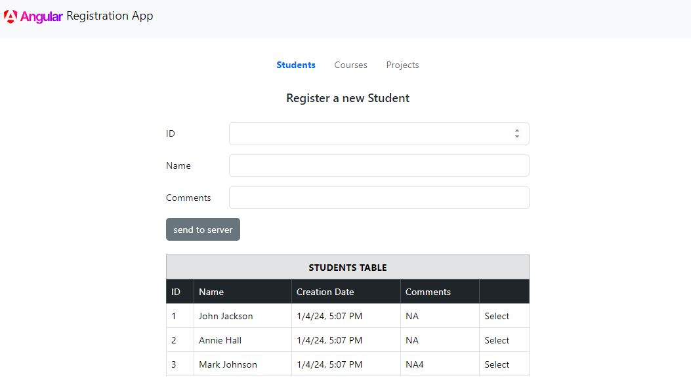

# ExcersiseOneApp
The project contains a registration system to add new students, courses or projects to the page. Each kind of register has its tab to add new entities or see the entities registered before.

*This project was generated with [Angular CLI](https://github.com/angular/angular-cli) version 17.0.7.*

____________

## Initializing json-server
Install the json-server dependency with the following command.

    npm install -g json-server

Access the folder where your *db.json* file is located and run the following command.    
    
    json-server --watch db.json 

## Initializing the project
    git clone https://github.com/jrlara1127/AngularBegginers.git
    cd AngularBegginers
    npm install

Run `npm start` for a dev server. Navigate to `http://localhost:4200/`. The application will automatically reload if you change any of the source files.

## Code scaffolding

Run `ng generate component component-name` to generate a new component. You can also use `ng generate directive|pipe|service|class|guard|interface|enum|module`.

## Build

Run `ng build` to build the project. The build artifacts will be stored in the `dist/` directory.

____________
## Further help

To get more help on the Angular CLI use `ng help` or go check out the [Angular CLI Overview and Command Reference](https://angular.io/cli) page.
