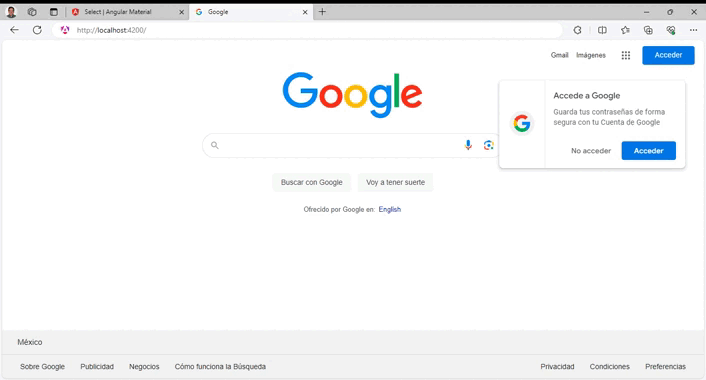

# ExcersiseOneApp
The project contains a registration system to add new students, courses or projects to each tab. Furthermore, the app can assign new students to a course, or a project.

Each kind of element has its tab to add new entities or see the entities registered before, select it and update its information. Furthermore, each form has its own clean button to erase the information written previously. As mentioned before, there exist another 2 tabs to assign students by courses, or students by projects, as shown in the image below.

*This project was generated with [Angular CLI](https://github.com/angular/angular-cli) version 17.0.7.* and using [Angular Material](https://v5.material.angular.io/) to style it.

 

# How to install and run this repository

We can install the *excercise3* branch using the following commands:

    git clone https://github.com/jrlara1127/angularAcademyProject.git
    cd angularAcademyProject
    git checkout excercise3
    git pull origin excercise3
    npm install

#### 1 Initializing json-server
Install the json-server dependency with the following command.

    npm install -g json-server

Access the folder where your *db.json* file is located and run the following command.    
    
    json-server --watch db.json 

#### 2 Initializing the project 

Run `npm start` for a dev server. Navigate to `http://localhost:4200/`. The application will automatically reload if you change any of the source files.

    npm start

## Code scaffolding

Run `ng generate component component-name` to generate a new component. You can also use `ng generate directive|pipe|service|class|guard|interface|enum|module`.

## Build

Run `ng build` to build the project. The build artifacts will be stored in the `dist/` directory.

____
## Further help

To get more help on the Angular CLI use `ng help` or go check out the [Angular CLI Overview and Command Reference](https://angular.io/cli) page.