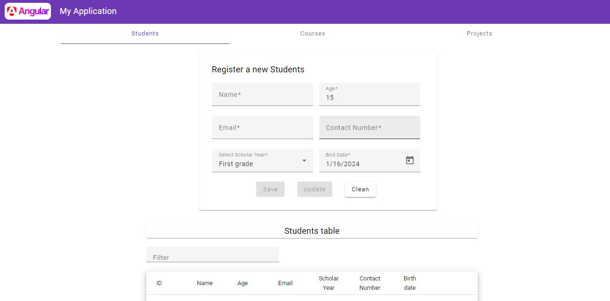

# ExcersiseOneApp
The project contains a registration system to add new students, courses or projects to each tab. 

Each kind of element has its tab to add new entities or see the entities registered before, select it and update its information. Furthermore, each form has its own clean button to erase the information written previously. 

*This project was generated with [Angular CLI](https://github.com/angular/angular-cli) version 17.0.7.* and using [Angular Material](https://v5.material.angular.io/) to style it.

# How to install and run this repository

We can install the *excercise2* branch using the following commands:

    git clone https://github.com/jrlara1127/angularAcademyProject.git
    cd angularAcademyProject
    git checkout excercise2
    git pull origin excercise2
    npm install

To run the project it will only be necessary to run the following command.

    npm start

## Code scaffolding

Run `ng generate component component-name` to generate a new component. You can also use `ng generate directive|pipe|service|class|guard|interface|enum|module`.

## Build

Run `ng build` to build the project. The build artifacts will be stored in the `dist/` directory.

## Further help

To get more help on the Angular CLI use `ng help` or go check out the [Angular CLI Overview and Command Reference](https://angular.io/cli) page.
